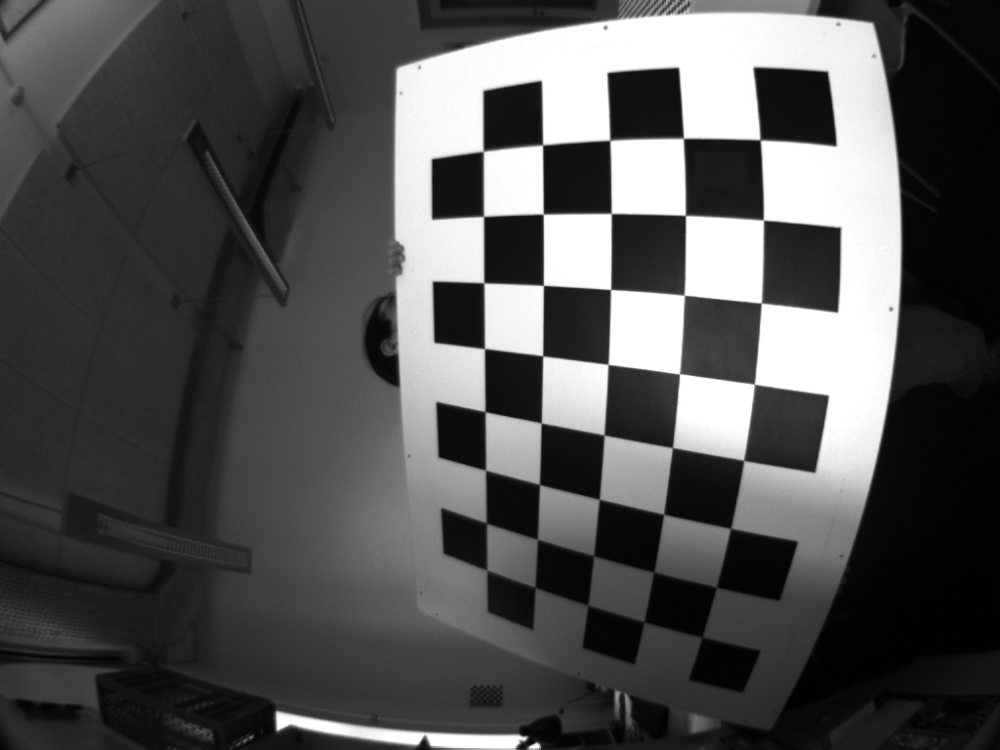

# Example Fish-Eye Camera

This test image is from the [OCamCalib Toolbox](https://sites.google.com/site/scarabotix/ocamcalib-toolbox/ocamcalib-toolbox-download-page) (University of Zurich), and has been provided by the following authors:

```
{
  @ARTICLE{Scaramuzza2006ICVS,
  author = {Scaramuzza, D., Martinelli, A., Siegwart, R.},
  title = {A Flexible Technique for Accurate Omnidirectional Camera Calibration and Structure from Motion},
  journal = {Proceedings of IEEE International Conference of Vision Systems (ICVS'06), New York, January 5-7, 2006},
  year = {2006}
}
```

The data, and the calibration files, are available from:

https://sites.google.com/site/scarabotix/ocamcalib-toolbox/ocamcalib-toolbox-download-page/sampleimages.zip?attredirects=0&d=1

Calibration data for the camera is available [here](./calib_results_fisheye.txt)

This is what the test image looks like


